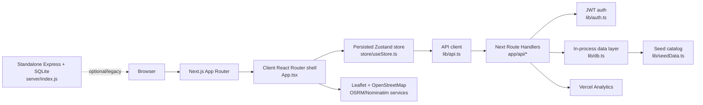

<div align="center">

```text
███████╗ ██████╗  ██████╗ ██████╗ ██╗███████╗███████╗██╗  ██╗
██╔════╝██╔═══██╗██╔═══██╗██╔══██╗██║╚══███╔╝██╔════╝╚██╗██╔╝
█████╗  ██║   ██║██║   ██║██║  ██║██║  ███╔╝ █████╗   ╚███╔╝
██╔══╝  ██║   ██║██║   ██║██║  ██║██║ ███╔╝  ██╔══╝   ██╔██╗
██║     ╚██████╔╝╚██████╔╝██████╔╝██║███████╗███████╗██╔╝ ██╗
╚═╝      ╚═════╝  ╚═════╝ ╚═════╝ ╚═╝╚══════╝╚══════╝╚═╝  ╚═╝
```

# FoodiezX

### A polished food-delivery experience for discovering restaurants, ordering meals, and tracking deliveries.

[](https://github.com/vincenzo-afk/foodiexz)
[](./package.json)
[](#license)
[](#testing)
[](./pnpm-lock.yaml)
[](https://github.com/vincenzo-afk/foodiexz/stargazers)
[](https://nextjs.org/)

[Live deployment](https://vercel.com/abnormal18use-9589s-projects/v0-project) · [Documentation](./BACKEND_SETUP.md) · [Report a bug](https://github.com/vincenzo-afk/foodiexz/issues/new?title=Bug%20report) · [Request a feature](https://github.com/vincenzo-afk/foodiexz/issues/new?title=Feature%20request)

</div>

> **Project status:** FoodiezX is an actively developed prototype with a functional Next.js application, Next Route Handlers, authenticated order flows, seeded restaurant data, wallet support, favorites, addresses, offers, and delivery tracking. Production deployment requires the hardening steps listed in [Known limitations](#known-limitations) and [Security](#security).

---

## Table of Contents

- [About the Project](#about-the-project)
  - [What FoodiezX Does](#what-foodiezx-does)
  - [Key Features](#key-features)
  - [Screenshots and Architecture](#screenshots-and-architecture)
- [Tech Stack](#tech-stack)
- [Getting Started](#getting-started)
  - [Prerequisites](#prerequisites)
  - [Installation](#installation)
  - [Configuration](#configuration)
  - [Running the Application](#running-the-application)
- [Usage](#usage)
  - [Typical Customer Flow](#typical-customer-flow)
  - [Useful Commands](#useful-commands)
- [API Reference](#api-reference)
  - [Authentication](#authentication)
  - [Restaurants and Search](#restaurants-and-search)
  - [Offers](#offers)
  - [Orders and Tracking](#orders-and-tracking)
  - [Account Data](#account-data)
- [Project Structure](#project-structure)
- [Features and Roadmap](#features-and-roadmap)
  - [Current Features](#current-features)
  - [Roadmap](#roadmap)
  - [Known Limitations](#known-limitations)
- [Testing](#testing)
- [Deployment](#deployment)
  - [Vercel or Another Next.js Host](#vercel-or-another-nextjs-host)
  - [Standalone Express Backend](#standalone-express-backend)
  - [Docker, Kubernetes, and Self-Hosting](#docker-kubernetes-and-self-hosting)
- [Contributing](#contributing)
- [Security](#security)
- [License](#license)
- [Acknowledgments](#acknowledgments)
- [References](#references)

---

## About the Project

### What FoodiezX Does

FoodiezX is a full-stack food-delivery prototype centered on a fast restaurant-discovery and ordering journey. The browser client is a Next.js application that mounts a client-side React Router shell through the catch-all route in [`app/[[...slug]]/page.tsx`](./app/[[...slug]]/page.tsx). Customers can browse seeded restaurants and dishes, filter and search the catalog, manage a cart, authenticate, save delivery addresses, apply offers, pay with supported demo methods, place orders, and follow a simulated rider on a map.

The current application uses Next.js Route Handlers under [`app/api`](./app/api) and the in-process data access layer in [`lib/db.ts`](./lib/db.ts). A separate Express + SQLite implementation remains in [`server/index.js`](./server/index.js) as a standalone backend path and migration reference; it is not started by the root `package.json` scripts. Treat the Next.js routes and `lib/db.ts` as the primary runtime when using the root application.

### Key Features

- **Restaurant discovery:** Browse six seeded restaurants spanning Indian, Chinese, Italian, Mexican, American, and Japanese cuisines.
- **Catalog search:** Search restaurants and dishes by name, cuisine, and description, with rating, price, cuisine, and sort filters.
- **Restaurant details:** View menus, dish metadata, vegetarian labels, ratings, bestseller labels, customizability, opening hours, and map coordinates.
- **Cart and checkout:** Add items, adjust quantities, calculate tax and delivery fees, display multi-restaurant fee warnings, add delivery notes, and choose a rider tip.
- **Offers and coupons:** Retrieve offers for an order total, calculate eligible discounts, and validate coupon codes such as `FOODIE50` and `FREEDEL` when present in the seed catalog.
- **Authentication:** Sign up and log in with bcrypt-hashed passwords and JSON Web Tokens (JWTs).
- **Account management:** Maintain a profile, dietary preference, saved addresses, default address, favorites, notifications, and recently viewed restaurants.
- **Wallet:** Top up a demo wallet and use its balance for order payment, with a capped top-up amount of ₹10,000 per request.
- **Order history:** View orders, item summaries, payment method, delivery address, rating, review, and status.
- **Live delivery simulation:** Poll tracking data, render a Leaflet map, calculate rider position and estimated time of arrival (ETA), and advance orders from `preparing` to `on-the-way` to `delivered`.
- **Responsive interface:** Use Tailwind CSS, Radix primitives, Lucide icons, Motion animations, toast notifications, dark-mode tokens, and accessible form components.
- **Informational pages:** Include About, Careers, Team, Blog, Help, Contact, Partner, FAQ, Terms, Privacy, Refund, and Cookie pages.

### Screenshots and Architecture

No screenshots are currently committed to the repository. Run the application locally and capture screenshots from the routes listed in [`App.tsx`](./App.tsx) if visual documentation is required.

The runtime architecture is intentionally compact:



The current route-handler data layer is process-local. New users, addresses, orders, favorites, and other mutable records live only for the lifetime of the running server instance. The standalone Express backend uses SQLite instead and should be treated as a separate deployment option rather than a second database automatically synchronized with the Next.js routes.

---

## Tech Stack

| Layer | Technologies | Repository evidence and purpose |
|---|---|---|
| Frontend | React `19.2.8`, Next.js `16.3.0`, TypeScript `^5`, React Router DOM, Zustand | The root manifest and [`App.tsx`](./App.tsx) define the client UI, routing shell, and state model. |
| Styling | Tailwind CSS `4.x`, `tw-animate-css`, PostCSS, CSS custom properties | [`app/globals.css`](./app/globals.css) defines the theme tokens and Tailwind entry points. |
| UI | Radix UI primitives, Lucide React, Sonner, Motion, React Hook Form, Zod | Component primitives and interaction libraries power dialogs, inputs, validation, icons, toasts, and animation. |
| Maps and geospatial UX | Leaflet, React Leaflet, OpenStreetMap tiles, Nominatim reverse geocoding, OSRM routing | [`components/AddressMap.tsx`](./components/AddressMap.tsx) and [`lib/db.ts`](./lib/db.ts) implement address selection and simulated tracking. |
| API layer | Next.js Route Handlers, `fetch`, JSON payloads | The current API is under [`app/api`](./app/api), with `/api` as the default browser base URL. |
| Authentication | `jsonwebtoken`, `bcryptjs`, bearer tokens | [`lib/auth.ts`](./lib/auth.ts) signs and verifies 30-day JWTs; auth routes hash passwords. |
| Primary persistence | In-process TypeScript data layer | [`lib/db.ts`](./lib/db.ts) seeds catalog data and stores mutable records in arrays for the life of the server instance. |
| Alternate persistence | SQLite via `sqlite3` in Express backend | [`server/index.js`](./server/index.js) creates `server/foodiezx.db` and seeds a separate standalone API. |
| Deployment and observability | Vercel-compatible Next.js build, `@vercel/analytics` | [`app/layout.tsx`](./app/layout.tsx) includes Vercel Analytics; no CI workflow is currently tracked. |
| Package management | pnpm lockfile and workspace configuration | [`pnpm-lock.yaml`](./pnpm-lock.yaml) and [`pnpm-workspace.yaml`](./pnpm-workspace.yaml) pin the dependency graph and allow native package builds. |

---

## Getting Started

### Prerequisites

| Requirement | Minimum or expected version | Notes |
|---|---:|---|
| Node.js | 20 LTS or newer recommended | The repository uses Next.js 16, React 19, and TypeScript 5. |
| pnpm | 9 or newer recommended | Use the lockfile for reproducible installs. npm can be used for the separate `server` package. |
| Git | Any current version | Required to clone and contribute. |
| Modern browser | Evergreen browser with JavaScript enabled | Leaflet map interactions require browser APIs. |

No third-party API key is required for the seeded catalog or the demo authentication flow. Map tiles, reverse geocoding, and routing use public OpenStreetMap ecosystem endpoints and should be reviewed for usage limits before production traffic is introduced.

### Installation

Clone the repository and install the root dependencies:

```bash
git clone https://github.com/vincenzo-afk/foodiexz.git
cd foodiexz
pnpm install
```

If pnpm is not installed, enable it through Corepack or install it globally:

```bash
corepack enable
corepack prepare pnpm@latest --activate
```

The root application does not require a database migration or a separate backend process for its current Next.js API routes. The catalog is loaded from [`lib/seedData.ts`](./lib/seedData.ts) when the server module is initialized.

### Configuration

Create `.env.local` in the repository root for the Next.js runtime. The file is ignored by Git through [`.gitignore`](./.gitignore).

```env
# Optional: defaults to the same-origin Next.js Route Handlers.
NEXT_PUBLIC_API_URL=/api
# Optional: signups using this email receive the admin role.
ADMIN_EMAIL=admin@example.com
# Required for scheduled-order cron processing when using a deployment job.
CRON_SECRET=replace-with-a-long-random-secret
# Required for production. The code currently falls back to a development secret.
JWT_SECRET=replace-with-a-long-random-secret
```

| Variable | Required | Default | Used by |
|---|---|---|---|
| `NEXT_PUBLIC_API_URL` | No | `/api` | [`lib/api.ts`](./lib/api.ts); set this only when the API is hosted at another origin. |
| `JWT_SECRET` | Strongly recommended in production | `foodiezx-dev-secret` in the current code | [`lib/auth.ts`](./lib/auth.ts) for signing and verifying JWTs. |
| `ADMIN_EMAIL` | No | Unset | [`app/api/auth/signup/route.ts`](./app/api/auth/signup/route.ts); matching signups receive the `admin` role. |
| `CRON_SECRET` | Recommended when using scheduled jobs | Unset | [`app/api/jobs/scheduled-orders/route.ts`](./app/api/jobs/scheduled-orders/route.ts); protects scheduled-order processing. |

Do not commit real secrets, production tokens, or user data. The current root code intentionally provides a development fallback for `JWT_SECRET`; production deployments must override it.

### Running the Application

Start the Next.js development server:

```bash
pnpm dev
```

Open [http://localhost:3000](http://localhost:3000). The main client routes include `/`, `/search`, `/restaurant/:id`, `/cart`, `/checkout`, `/auth`, `/orders`, `/order/:id`, `/profile`, `/favorites`, `/offers`, `/addresses`, `/settings`, `/scheduled-orders`, and `/admin`. The informational routes are listed in [`App.tsx`](./App.tsx).

For a production-like local run:

```bash
pnpm build
pnpm start
```

The root scripts are defined in [`package.json`](./package.json): `dev`, `build`, `start`, `lint`, `typecheck`, and `test`.

---

## Usage

### Typical Customer Flow

1. Open the home page and browse the seeded restaurants.
2. Use search, cuisine filters, rating filters, price range, or sorting to narrow the catalog.
3. Open a restaurant, review its menu, and add dishes to the cart.
4. Sign up or log in from `/auth` when an authenticated action is required.
5. Select or create a saved delivery address, add a note or tip, apply an eligible offer, and choose a payment method.
6. Place the order and open the tracking view to see status, ETA, route progress, and rider position.
7. Review past orders from `/orders` and manage profile, wallet, addresses, favorites, and notification settings from the account pages.

### Useful Commands

| Command | Purpose |
|---|---|
| `pnpm install` | Install the root dependency graph from `pnpm-lock.yaml`. |
| `pnpm dev` | Start the Next.js development server. |
| `pnpm lint` | Run the repository’s ESLint configuration. |
| `pnpm typecheck` | Run strict TypeScript validation. |
| `pnpm test` | Run the Vitest unit-test suite. |
| `pnpm build` | Create a production Next.js build. |
| `pnpm start` | Serve the production build. |
| `cd server && npm install` | Install dependencies for the separate Express + SQLite backend. |
| `cd server && npm run dev` | Start the legacy/standalone backend with nodemon. |
| `cd server && npm start` | Start the standalone backend with Node.js. |

### Example: Sign Up and Place an Order

The current API uses JSON request bodies and bearer authentication. A successful sign-up returns a JWT and a user object.

```bash
API_URL="http://localhost:3000/api"

curl -sS -X POST "$API_URL/auth/signup" \
  -H 'Content-Type: application/json' \
  -d '{
    "name": "Demo Customer",
    "email": "demo@example.com",
    "password": "change-me-123",
    "phone": "+91 90000 00000"
  }'
```

Use the returned token for protected requests:

```bash
TOKEN="paste-the-token-from-signup"

curl -sS "$API_URL/restaurants" \
  -H "Authorization: Bearer $TOKEN"
```

A complete order request must include a restaurant, total, payment method, delivery address, and item list:

```bash
curl -sS -X POST "$API_URL/orders" \
  -H 'Content-Type: application/json' \
  -H "Authorization: Bearer $TOKEN" \
  -d '{
    "restaurantId": "1",
    "restaurantName": "Spice Junction",
    "total": 359,
    "paymentMethod": "cod",
    "deliveryAddress": {
      "address": "Block 42, Connaught Place, New Delhi",
      "lat": 28.6304,
      "lng": 77.2177
    },
    "items": [
      {
        "dishId": "d1",
        "name": "Chicken Biryani",
        "price": 299,
        "quantity": 1,
        "isVeg": false
      }
    ],
    "tip": 20,
    "deliveryNote": "Please call on arrival"
  }'
```

---

## API Reference

The current API is implemented by Next.js Route Handlers under [`app/api`](./app/api). Unless `NEXT_PUBLIC_API_URL` is changed, use the same-origin prefix `/api`. Protected routes require `Authorization: Bearer <JWT>`.

### Authentication

| Method | Endpoint | Auth | Purpose |
|---|---|---:|---|
| `POST` | `/api/auth/signup` | No | Create an account, hash the password, seed a ₹500 wallet balance, and return a token. |
| `POST` | `/api/auth/login` | No | Validate credentials and return a token plus user profile. |
| `GET` | `/api/user` | Yes | Return the current user, role, memberships, addresses, wallet, dietary preference, notification metadata, and a refreshed token. |
| `GET` | `/api/health` | No | Return `{ "status": "ok" }`. |

Example login:

```bash
curl -sS -X POST "http://localhost:3000/api/auth/login" \
  -H 'Content-Type: application/json' \
  -d '{"email":"demo@example.com","password":"change-me-123"}'
```

### Restaurants and Search

| Method | Endpoint | Auth | Purpose |
|---|---|---:|---|
| `GET` | `/api/restaurants` | No | List restaurants with summary fields and menu items. |
| `GET` | `/api/restaurants/:id` | No | Return one restaurant and its menu. |
| `GET` | `/api/restaurants/search?q=...` | No | Search restaurant names, cuisines, and descriptions. |
| `GET` | `/api/dishes/search?q=...` | No | Search dish names and descriptions. |

### Offers

| Method | Endpoint | Auth | Purpose |
|---|---|---:|---|
| `GET` | `/api/offers` | No | Return all offers. Pass `?total=500` to calculate eligibility and discount amount. |
| `POST` | `/api/offers` | No | Validate a coupon with `{ "code": "FOODIE50", "orderTotal": 500 }`. |

A valid offer response includes `valid: true`, the calculated `discount`, and a human-readable `message`. Invalid codes and orders below the minimum return `valid: false`.

### Orders and Tracking

| Method | Endpoint | Auth | Purpose |
|---|---|---:|---|
| `POST` | `/api/orders` | Yes | Validate the restaurant, catalog items, address, totals, and payment method; create an order and return its generated `orderId`. Wallet payments are debited only after validation succeeds, and `Idempotency-Key` prevents duplicate checkout submissions. |
| `GET` | `/api/orders` | Yes | List the authenticated user’s orders with items, status, ETA, payment method, and delivery address. |
| `GET` | `/api/orders/:id` | Yes | Return one order and its items if it belongs to the authenticated user. |
| `DELETE` | `/api/orders/:id` | Yes | Cancel an eligible `preparing` order. Cancellation is rejected after the rider is on the way or the order is delivered. |
| `POST` | `/api/orders/:id/review` | Yes | Add a rating and review to an owned order. |
| `GET` | `/api/orders/:id/status` | Yes | Return the current order status. |
| `PUT` | `/api/orders/:id/status` | Yes | Allow an authenticated customer to cancel their own `preparing` order; other status transitions are controlled by the server’s delivery simulation. |
| `GET` | `/api/orders/:id/tracking` | Yes | Return status history, rider position, route, progress, distance, and ETA. |

The tracking view polls the tracking endpoint every five seconds and uses Leaflet to display the delivery route. The route geometry is requested from OSRM when available, with a straight-line fallback in the data layer.

### Account Data

| Method | Endpoint | Auth | Purpose |
|---|---|---:|---|
| `GET` | `/api/addresses` | Yes | List the authenticated user’s saved addresses. |
| `POST` | `/api/addresses` | Yes | Create a saved address. The first address becomes the default automatically. |
| `PUT` | `/api/addresses` | Yes | Update an address using an `id` query parameter. |
| `PUT` | `/api/addresses/:id` | Yes | Update an owned address. |
| `DELETE` | `/api/addresses/:id` | Yes | Delete an owned address. |
| `PUT` | `/api/addresses/:id/default` | Yes | Make an owned address the default. |
| `GET` | `/api/favorites` | Yes | List favorite restaurants. |
| `POST` | `/api/favorites/:restaurantId` | Yes | Add a restaurant to favorites. |
| `DELETE` | `/api/favorites/:restaurantId` | Yes | Remove a restaurant from favorites. |
| `GET` | `/api/wallet` | Yes | Return wallet balance and the latest wallet transactions. |
| `POST` | `/api/wallet` | Yes | Top up the wallet; each request is capped at ₹10,000. |
| `GET` | `/api/notifications` | Yes | List server-backed notifications and the unread count. |
| `PUT` | `/api/notifications/:id` | Yes | Mark an owned notification as read. |
| `POST` | `/api/notifications` | Yes | Mark all owned notifications as read. |
| `PUT` | `/api/notifications/preferences` | Yes | Save in-app, email, order-update, promotion, timezone, and personalization preferences. |
| `POST` | `/api/cart/validate` | No | Recalculate catalog prices, availability, fees, and cart changes before checkout. |
| `GET` | `/api/recommendations` | Optional | Return deterministic, explainable discovery sections with anonymous fallbacks. |
| `POST` | `/api/analytics` | Optional | Record a validated privacy-minimized funnel event. |
| `GET` | `/api/scheduled-orders` | Yes | List the authenticated customer’s scheduled orders. |
| `POST` | `/api/scheduled-orders` | Yes | Create a future order with cutoff and timezone metadata. |
| `PUT`/`DELETE` | `/api/scheduled-orders/:id` | Yes | Reschedule or cancel an owned scheduled order before its cutoff. |
| `POST` | `/api/jobs/scheduled-orders` | Admin or cron secret | Revalidate and process due scheduled orders idempotently. |
| `GET` | `/api/admin/overview` | Admin | Return operational metrics, active orders, failed notifications, and audit activity. |
| `GET` | `/api/admin/users` | Admin | List users without password fields. |
| `PUT` | `/api/admin/users/:id/role` | Admin | Assign `user`, `restaurant_manager`, or `admin` roles. |
| `GET` | `/api/admin/audit` | Admin | List role-change audit records. |
| `POST` | `/api/contact` | No | Accept a contact message in the demo in-memory inbox. |

Protected routes return `401` for a missing or invalid token. Typical validation failures return `400`, missing resources return `404`, insufficient wallet balance returns `402`, and invalid order state transitions can return `409`.

---

## Project Structure

```text
foodiexz/
├── app/
│   ├── [[...slug]]/page.tsx       # Catch-all entry that mounts the client app
│   ├── api/                       # Current Next.js Route Handlers
│   ├── globals.css                # Tailwind entry and theme variables
│   ├── layout.tsx                 # Metadata, fonts, analytics, root layout
│   └── not-found.tsx              # App-router fallback page
├── components/
│   ├── pages/                     # Customer and informational screens
│   ├── ui/                        # Reusable Radix/Tailwind primitives
│   ├── AddressMap.tsx             # Leaflet address picker
│   ├── Map.tsx                    # Delivery map and route rendering
│   ├── Navbar.tsx                 # Global navigation
│   ├── Footer.tsx                 # Global footer
│   ├── DishCard.tsx               # Menu item card and cart actions
│   ├── RestaurantCard.tsx         # Restaurant summary card
│   ├── OrderTracking.tsx          # Tracking-related UI dependencies
│   └── SplashScreen.tsx            # Initial loading experience
├── lib/
│   ├── api.ts                     # Browser API client
│   ├── auth.ts                    # JWT signing, verification, and guards
│   ├── db.ts                      # Current in-process data layer and tracking helpers
│   ├── seedData.ts                # Restaurants, dishes, and offers
│   └── utils.ts                   # Shared class-name utility
├── store/useStore.ts              # Persisted Zustand state and business logic
├── server/
│   ├── index.js                   # Standalone Express + SQLite backend
│   └── package.json               # Backend-only scripts and dependencies
├── public/                        # Icons, logos, and fallback assets
├── App.tsx                        # BrowserRouter route map and app shell
├── package.json                   # Root scripts and dependencies
├── pnpm-lock.yaml                 # Locked root dependency graph
├── next.config.mjs                # Next.js build and image configuration
├── components.json                # shadcn/ui aliases and styling metadata
├── BACKEND_SETUP.md                # Standalone backend setup notes
├── README_API_MIGRATION.md         # Earlier API migration notes
└── Attributions.md                 # shadcn/ui and Unsplash attributions
```

---

## Features and Roadmap

### Current Features

- [x] Seeded restaurant and dish catalog.
- [x] Restaurant and dish search.
- [x] Rating, cuisine, price, and sort filters.
- [x] Cart quantity management and multi-restaurant fee warning.
- [x] Checkout with saved addresses, delivery notes, tips, offers, and demo payment methods.
- [x] JWT authentication with bcrypt password hashing.
- [x] Favorites and recently viewed restaurants.
- [x] Wallet top-ups and wallet payment validation.
- [x] Orders, cancellation rules, reviews, notifications, and order history.
- [x] Simulated delivery tracking with Leaflet, ETA, status history, and OSRM route lookup.
- [x] Expiry-aware offers and coupon validation with clear eligibility feedback.
- [x] Idempotent checkout requests, server-side catalog validation, current-price reorder checks, coupon reconciliation, and cart validation snapshots.
- [x] Role-aware admin dashboard with server-side role guards, user role management, audit logs, operational metrics, and funnel counters.
- [x] Server-backed in-app notifications with unread counts, read actions, order-state events, preference controls, and deduplication keys.
- [x] Scheduled orders with cutoff windows, timezone metadata, cancellation, rescheduling, cron-compatible processing, and menu/price revalidation.
- [x] Deterministic explainable recommendations, personalized discovery controls, and privacy-minimized search, view, cart, and order analytics.
- [x] Responsive theme tokens, dark-mode styles, accessible UI primitives, and toast feedback.
- [x] Vercel Analytics integration in the root layout.

### Roadmap

The next production milestones are:

1. Move `lib/db.ts` to a durable transactional database with migrations, repository helpers, and wallet/order reconciliation.
2. Add a real payment provider, webhook verification, refunds, and persistent checkout reservations.
3. Add email/push provider adapters behind the existing notification event and retry contracts.
4. Add restaurant-manager membership CRUD, menu availability controls, delivery zones, and operational order controls.
5. Expand route and browser coverage, accessibility automation, dependency review, and smoke deployment checks.
6. Add durable contact-message handling, retention policies, analytics aggregation, export controls, and feature-flagged rollouts.

### Known Limitations

- The current Next.js data layer is still in memory. A restart or serverless instance replacement loses users, addresses, orders, favorites, reviews, wallet history, notifications, scheduled orders, audit logs, and analytics events. The new feature contracts are ready for a durable repository migration, but they are not production-grade persistence yet.
- The contact endpoint stores messages in an in-memory array and is therefore not a durable support inbox.
- The wallet transaction log is also process-local; wallet balance changes should not be treated as production-grade accounting.
- `JWT_SECRET` has a development fallback in the current code. Production deployments must override it with a high-entropy secret.
- Public OpenStreetMap, Nominatim, and OSRM services are used without application-owned rate limiting or a commercial service agreement.
- The repository contains a standalone Express + SQLite backend alongside the current Next.js Route Handlers. They have different persistence behavior and should not be run as if they share state.
- Automated coverage currently focuses on validation, tracking, notification deduplication, scheduled-order due selection, and order idempotency; route and browser coverage still needs to grow.
- A CI quality workflow is tracked at [`.github/workflows/ci.yml`](./.github/workflows/ci.yml), but browser tests, deployment smoke tests, and coverage reporting are not yet configured.

[Changelog and repository history](https://github.com/vincenzo-afk/foodiexz/commits/main) · [Open issues](https://github.com/vincenzo-afk/foodiexz/issues)

---

## Testing

The repository now exposes lint, type-check, test, and build scripts.

```bash
pnpm install --frozen-lockfile
pnpm lint
pnpm typecheck
pnpm test
pnpm build
```

The current automated suite covers validation schemas, tracking math, future-timestamp clamping, user-scoped order idempotency, notification deduplication, and scheduled-order due selection. Browser-level regression tests and coverage reporting are not yet configured. The release smoke test should additionally verify authentication, cart price reconciliation, checkout recovery, role-restricted admin access, notification read state, scheduled-order creation/processing, recommendation opt-out, analytics permissions, address management, coupon expiry, wallet top-up, cancellation, review eligibility, and protected tracking access.

---

## Deployment

### Vercel or Another Next.js Host

The root app is structured for a standard Next.js deployment:

```bash
pnpm install --frozen-lockfile
pnpm build
pnpm start
```

For Vercel:

1. Import `https://github.com/vincenzo-afk/foodiexz` into a Vercel project.
2. Select the detected Next.js framework preset.
3. Set `JWT_SECRET` to a strong production secret.
4. Leave `NEXT_PUBLIC_API_URL` unset or set it to `/api` when using same-origin Route Handlers.
5. Deploy and verify `/api/health`, sign-up, restaurant browsing, checkout, and tracking.

The current in-process persistence model is not suitable for reliable multi-instance production deployment. Add a shared database and durable storage before treating a Vercel deployment as production-ready.

### Standalone Express Backend

The repository also contains an older standalone backend with SQLite. Use it only when you deliberately want that separate architecture:

```bash
cd server
npm install
cat > .env <<'EOF'
PORT=5000
JWT_SECRET=replace-with-a-long-random-secret
CLIENT_URL=http://localhost:3000
EOF
npm start
```

The backend listens on `http://localhost:5000` by default and writes its SQLite database to `server/foodiezx.db`. Its historical setup notes are in [`BACKEND_SETUP.md`](./BACKEND_SETUP.md). The root Next.js client defaults to `/api`, so connecting it to this standalone backend requires an explicit API proxy or a compatible `NEXT_PUBLIC_API_URL` configuration and careful endpoint compatibility testing.

### Docker, Kubernetes, and Self-Hosting

No `Dockerfile`, Docker Compose file, or Kubernetes manifests are currently tracked. For a self-hosted Next.js deployment, build the root application on a Node.js host and run `pnpm start` behind a reverse proxy with HTTPS. For container or Kubernetes deployment, add a non-root image, health check for `/api/health`, environment injection for `JWT_SECRET`, durable database storage, structured logs, and a shared session/data strategy before exposing the service publicly.

---

## Contributing

Contributions are welcome through GitHub pull requests.

1. Fork the repository and create a focused branch from `main`.
2. Use a descriptive branch name such as `feat/search-filters`, `fix/order-cancellation`, or `docs/readme`.
3. Install dependencies with `pnpm install` and run `pnpm lint` before committing.
4. Keep UI changes, API changes, and data-model changes logically separated.
5. Update the relevant documentation when behavior, environment variables, or endpoints change.
6. Open a pull request with a clear summary, testing notes, screenshots for visual changes, and any migration or deployment considerations.

Use conventional-style commit messages such as `feat: add restaurant sorting`, `fix: protect order lookup`, `docs: clarify local setup`, or `chore: refresh dependencies`. No `CONTRIBUTING.md`, code of conduct, or pull request template is currently tracked; until those files are added, the workflow above is the project convention.

---

## Security

FoodiezX includes bcrypt password hashing, JWT verification, ownership checks for authenticated resources, validated request bodies, protected order status/tracking endpoints, catalog-backed order items, and idempotent checkout requests. These are useful foundations, not a complete production security program.

Before production use:

- Replace all development JWT fallbacks with a secret supplied through a protected environment manager.
- Add request-body schemas, input length limits, rate limiting, CSRF protection where applicable, and abuse monitoring.
- Add security headers, HTTPS, strict CORS, secure cookie or token storage strategy, and dependency vulnerability scanning.
- Use a durable database with least-privilege credentials, backups, migrations, and transactional order and wallet operations.
- Do not use the demo wallet as a real financial ledger or connect the demo payment methods to real funds without a reviewed payment integration.
- Report suspected vulnerabilities privately through the repository owner’s [GitHub profile](https://github.com/vincenzo-afk) rather than posting exploit details publicly in an issue.

No `SECURITY.md` policy or automated dependency-scanning workflow is currently tracked.

---

## License

No `LICENSE` file is currently present in the repository, so no open-source license has been declared. Until the project owner adds a license, assume that the code is not licensed for reuse beyond permissions granted by applicable law or the repository owner. See the [repository license settings](https://github.com/vincenzo-afk/foodiexz) for the current project state.

---

## Acknowledgments

- [Next.js](https://nextjs.org/) and [React](https://react.dev/) for the application runtime.
- [Tailwind CSS](https://tailwindcss.com/), [Radix UI](https://www.radix-ui.com/), [Lucide](https://lucide.dev/), [Motion](https://motion.dev/), and [Sonner](https://sonner.emilkowal.ski/) for the interface system.
- [Leaflet](https://leafletjs.com/), [OpenStreetMap](https://www.openstreetmap.org/), [Nominatim](https://nominatim.org/), and [OSRM](https://project-osrm.org/) for map and routing capabilities.
- [shadcn/ui](https://ui.shadcn.com/) components, attributed in [`Attributions.md`](./Attributions.md).
- [Unsplash](https://unsplash.com/) imagery, attributed in [`Attributions.md`](./Attributions.md).
- The FoodiezX contributors and the repository owner, [vincenzo-afk](https://github.com/vincenzo-afk).

---

## References

The README is grounded in the repository’s source and configuration files:

1. [Root package manifest](./package.json)
2. [Application shell and route map](./App.tsx)
3. [Current Next.js API routes](./app/api)
4. [Frontend API client](./lib/api.ts)
5. [JWT authentication helpers](./lib/auth.ts)
6. [Current in-process data layer](./lib/db.ts)
7. [Seed catalog](./lib/seedData.ts)
8. [Persisted Zustand store](./store/useStore.ts)
9. [Standalone Express backend](./server/index.js)
10. [Backend setup guide](./BACKEND_SETUP.md)
11. [API migration notes](./README_API_MIGRATION.md)
12. [Attributions](./Attributions.md)

---

<p align="center">
  <a href="#foodiezx">Back to top</a>
  <br />
  Built with care by <a href="https://github.com/vincenzo-afk">BHARANI KUMAR S</a> and the FoodiezX contributors.
</p>

[license]: #license
[1]: ./package.json
[2]: ./App.tsx
[3]: ./app/api
[4]: ./lib/api.ts
[5]: ./lib/auth.ts
[6]: ./lib/db.ts
[7]: ./lib/seedData.ts
[8]: ./store/useStore.ts
[9]: ./server/index.js
[10]: ./BACKEND_SETUP.md
[11]: ./README_API_MIGRATION.md
[12]: ./Attributions.md
